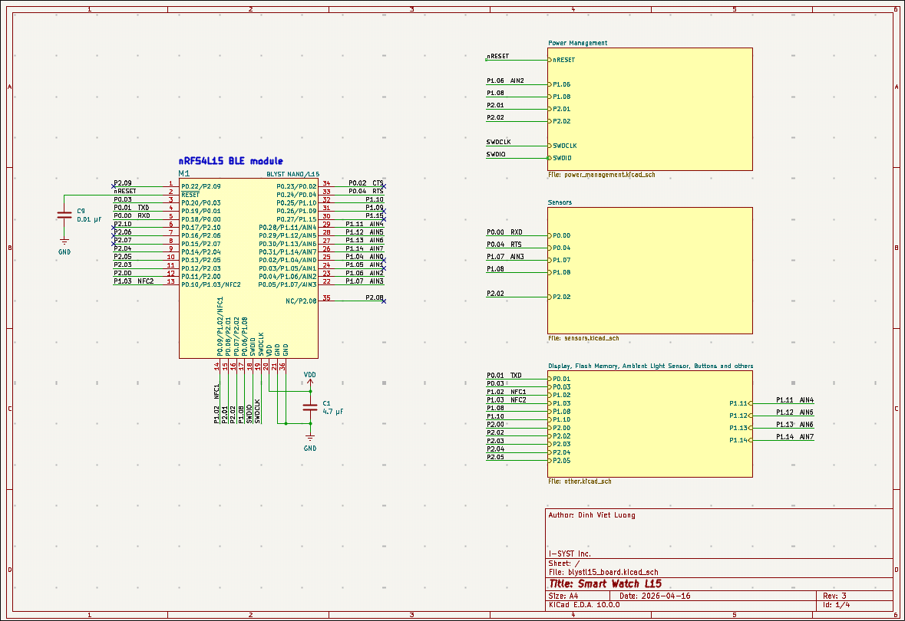
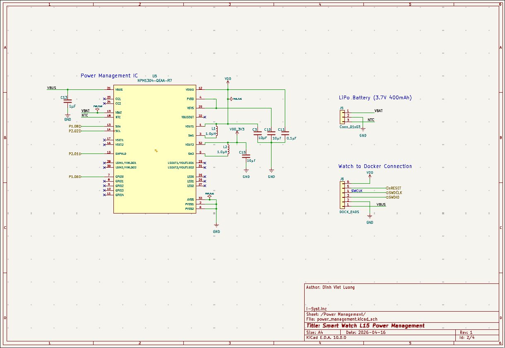
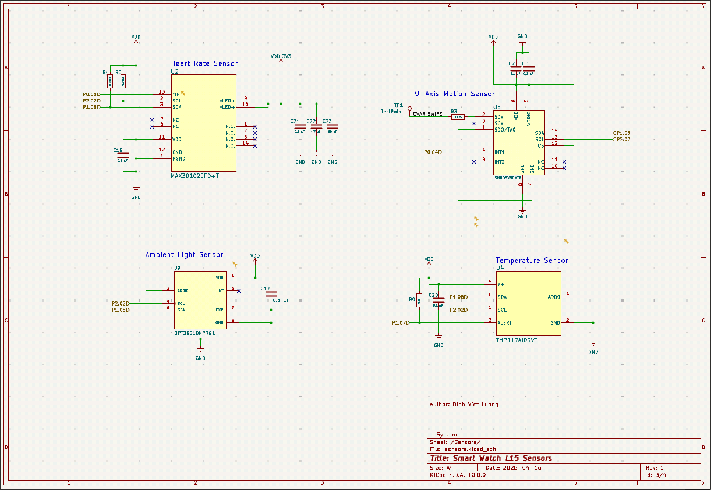
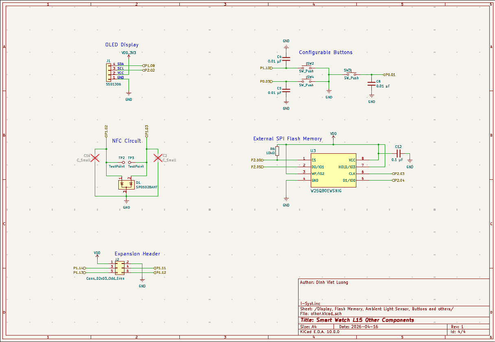
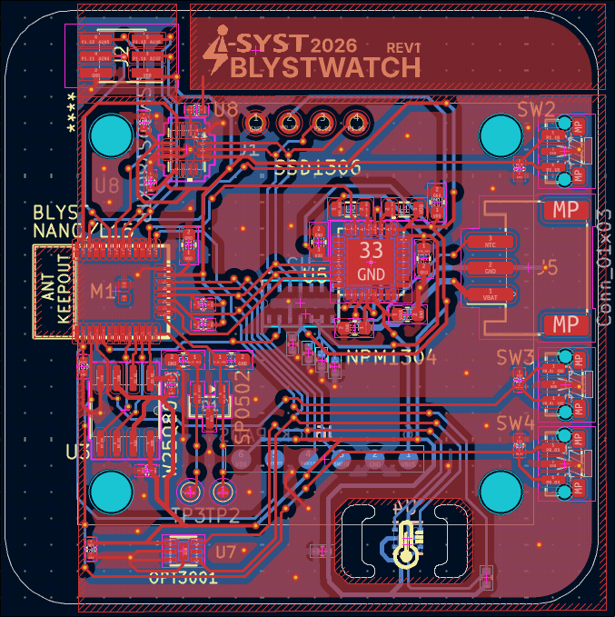
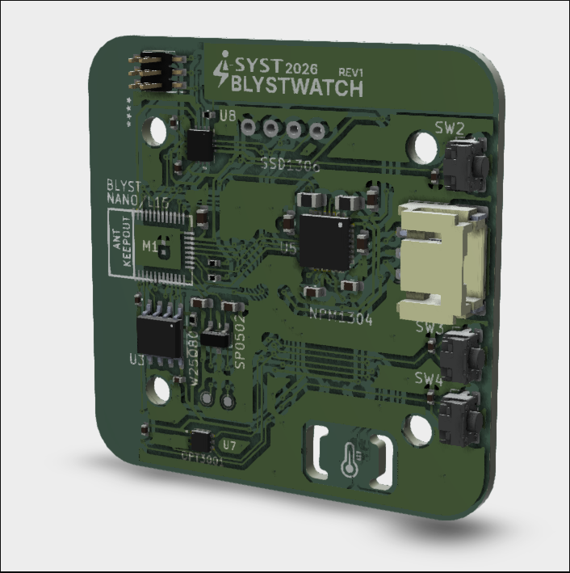
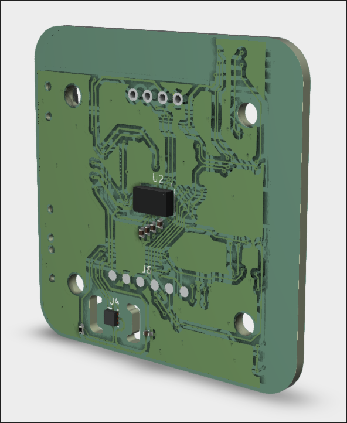

# Smart-Watch-L15: Hardware Design

This directory contains the hardware design files, schematics, and board layouts for the **Smart-Watch-L15**. This device serves as a highly integrated demo board to showcase advanced wearable development utilizing the **BlystL15 module** (based on the Nordic nRF54L15) and the **IOComposer AI** from I-Syst Inc. 

This prototype design emphasizes ultra-low power consumption, clinical-grade sensor accuracy, and a high-density HDI (High-Density Interconnect) layout suitable for a modern smartwatch form factor. For future improvements to the design, a proper industrial standard **touchscreen** display would elevate this design to be more "finished".

---

## ⚙️ Core Components: Uses & Constraints

The smartwatch PCB integrates several specialized ICs to handle processing, power management, and biometric sensing. Here is a breakdown of the primary components, their roles, and specific hardware design constraints.

### 1. Main MCU: BlystL15 (Nordic nRF54L15)
* **Use:** Acts as the central processing unit and Bluetooth Low Energy (BLE) radio. It also utilizes a built-in NFC-A tag peripheral for optional NFC extensions.
* **Constraints:** Requires strict adherence to RF keep-out zone to maintain antenna efficiency. Because smartwatch batteries are small, the firmware will heavily relies on deep sleep modes, waking only via hardware interrupts from the sensors.

### 2. Power Management: Nordic nPM1304 (PMIC)
* **Use:** Manages battery charging and system power. It utilizes built-in buck converters to supply stable 1.8V (logic) and 3.3V (LED/Sensor) rails.
* **Constraints:** Requires robust power routing. For 0.5mm power traces, via stitching (multiple 0.6mm/0.3mm vias) is used when changing layers to drop electrical resistance and parasitic inductance.

### 3. Temperature Sensor: Texas Instruments TMP117
* **Use:** It operates autonomously to monitor temperature and triggers a hardware interrupt (via the `ALERT` pin) if a threshold (e.g., a fever) is crossed, saving significant MCU power.
* **Constraints:** Requires strict local decoupling (0.1µF capacitor directly on the V+ pin). The `ALERT` pin requires a dedicated pull-up resistor and the TMP117 is placed far from the hot PMIC modules to reduce noises.

### 4. Heart Rate & SpO2 Sensor: Analog Devices MAX30102
* **Use:** An integrated pulse oximetry and heart-rate monitor module containing internal Red/IR LEDs and photodetectors. 
* **Constraints:** This 14-pin optical module requires a split power supply: 1.8V for internal logic and a separate 3.3V line capable of handling the high current spikes of the internal LEDs.

### 5. Ambient Light Sensor: Texas Instruments OPT3001-Q1
* **Use:** Measures visible light intensity to match the human eye's. This allows the watch to adjust screen brightness accurately, even under dark glass aesthetics.
* **Constraints:** Highly sensitive to secondary optical reflections. The PCB layout must keep structural components away from the sensor's field of view (ideally placing bulky components on the opposite side of the PCB).

### 6. Storage: Winbond W25Q80EW (8M-bit Serial Flash)
* **Use:** 1.8V ultra-low-power flash memory used for local data logging (storing offline biometric data) and copying firmware to RAM.
* **Constraints:** Must share the SPI bus efficiently and requires standard high-speed trace routing constraints to maintain signal integrity during fast read/write operations.

### 7. LSM6DSV80XTR 6-Axis IMU & QVAR Electrodes (Swipe Interface)
* **Use:** The IMU handles motion tracking (steps, wrist-tilt wake), while QVAR technology provides a capacitive swipe interface directly on the PCB.
* **Constraints:** The QVAR electrode requires absolute isolation. The PCB layer directly beneath the QVAR pad must be completely voided of copper pours (both ground and power) and signal traces to prevent parasitic capacitance. High-speed digital lines (like $I^2C$) are routed far away from this zone.

---

## 📐 Hardware Design Gallery

*(The following screenshots highlight the routing, schematic logic, and physical form factor of the Smart-Watch-L15).*

### Schematics
The system is divided into logical blocks to isolate power, sensing, and processing.

*Fig 1: BlystL15 MCU.*

*Fig 2: nPM1304 PMIC, Battery and Dock Connectors.*

*Fig 3: Sensors including the LSM6DSV80X (6-axis motion sensor), MAX30102 (Pulse Oximeter and Heart Rate), TMP117 (Temperature Sensor), and OPT3001-Q1 (Light Sensor).*

*Fig 4: Flash memory, Configurable Buttons, OLED Connectors and Expansion Header*

### PCB Layout

*Fig 5: Top-down view of the routed PCB, showcasing the dense component placement and carefully voided QVAR keep-out zones.*

### 3D Renders
Final physical visualization of the assembled board to be imported in SolidWorks for the design of the Watch's Case.

  
*Fig 6: 3D Render (Top view) showing the sensor array and screen interface footprint.*

  
*Fig 7: 3D Render (Bottom view) showing the BlystL15 module and exposed charging/programming test pads.*
